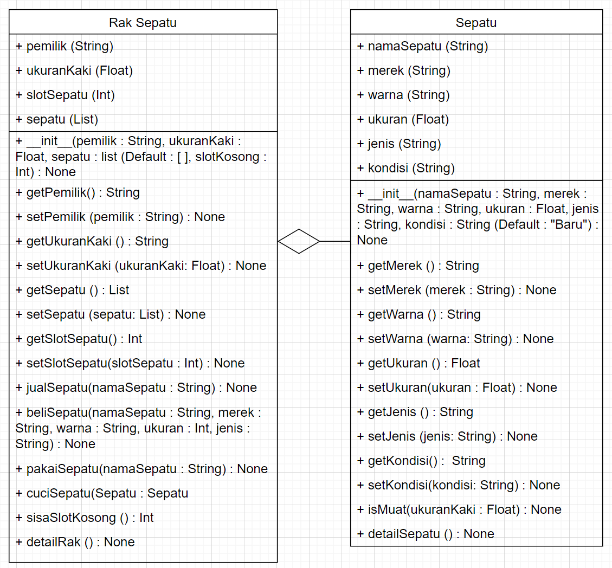
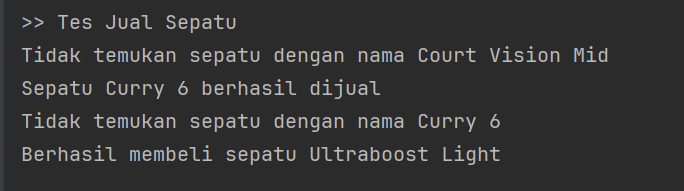
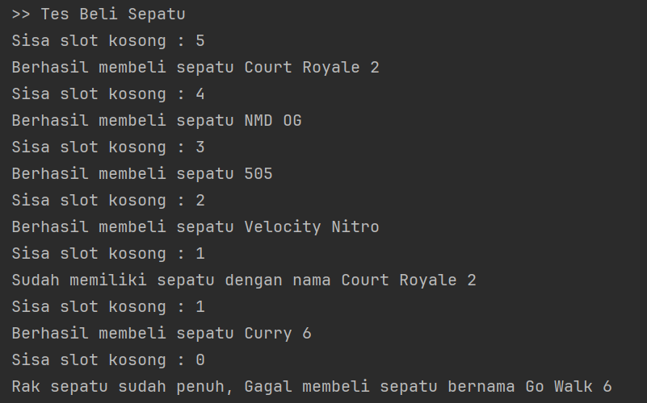
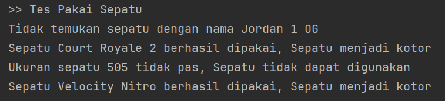
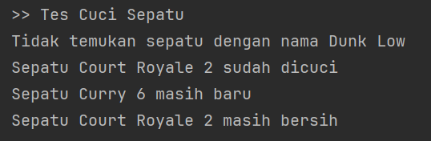

# Soal Latihan UTS PrStrukDat
## Mohon dibaca terlebih dahulu
Halo buat kamu yang lagi ngerjain ini, 
kayanya soal ini jauh lebih susah daripada soal UTS ku taun lalu… 
Kapan lagi dapet soal Latihan yang lebih susah kan ya daripada UTS nya HEHE… 
Jdi kalo emang dirasa susah sebenarnya wajar, 
Waktu estimasi kalian ngerjain harusnya sekitar 2 jam 
(tapi harusnya bisa lebih cepet).
<br>
Kalo bingung, please jangan GPT dlu, prefer nanya temen atau DM aku (Nic T) di @nicho_tanugroho dulu. Sebisanya jangan AI ygy.
<br>SEMANGAT!!
<br> NB: Kalo ada cacat soal mon maaf ya ges yak, uda lelah... Di PC/DM aja aku, nanti ku revisi
<br> <b> BOLEH DISEBARLUASKAN YA GES YA, TAPI JANGAN BRUTAL BRUTAL AMAT</b>
## Diagram Fungsi
Mohon diperhatikan terlebih dahulu diagram berikut ini untuk memahami relasi antar objek

NB : ukuran itu semuanya Float, ada tipo di diagram tapi aku malas benerin hehe
## Penjelasan Class Sepatu
### Attribute
#### namaSepatu
Bertipe data String untuk menyimpan nama sepatu
#### merek
Bertipe data String untuk menyimpan merek sepatu
#### warna
Bertipe data String untuk menyimpan warna sepatu
#### ukuran
Bertipe data Float untuk menyimpan ukuran sepatu
#### jenis
Bertipe data Integer untuk menyimpan jenis sepatu
#### kondisi
Bertipe data String untuk menyimpan ukuran sepatu, pilihannya adalah
<ol>
<li>Baru</li>
<li>Bersih</li>
<li>Kotor</li>
</ol>
Dengan default value "Baru"

### Method
#### __init\_\_
Konstruktor kelas Sepatu yang memiliki parameter sebagai berikut
<ul>
<li> namaSepatu : String</li>
<li> merek : String </li>
<li> warna : String</li>
<li> ukuran : Float</li>
<li> jenis : String</li>
<li> kondisi : String (Default valuenya "Baru")</li>
</ul>
Fungsi ini bertujuan untuk menginisialisasikan kelas Sepatu<br>

#### get(...) dan set(...)
Bertujuan untuk mengatur/mengambil attribut yang dimiliki oleh kelas ini

#### isMuat
Bertujuan untuk mengecek apakah sepatu tersebut muat/tidak yang memiliki parameter sebagai berikut
<ul>
<li> ukuranKaki : Float</li>
</ul>
Fungsi ini memiliki 2 peluang output
<ol>
<li> Selisih ukuranSepatu dan ukuranKaki lebih besar dari 0.5, Sepatu tidak dapat dipakai (mengembalikan False)</li>
<li> Selisih ukuranSepatu dan ukuranKaki lebih kecil sama dengan dari 0.5, Sepatu muat (mengembalikan True)</li>
</ol>
NB : Gunakan fungsi abs() untuk nilai mutlak

#### detailSepatu
Fungsi ini mengeluarkan detail sepatu dengan format sebagai berikut
```
Nama Sepatu 	: namaSepatu
Merek Sepatu 	: merek
Warna Sepatu 	: warna
Ukuran Sepatu 	: ukuran
Jenis Sepatu 	: jenis 
Kondisi Sepatu 	: kondisi
```

## Penjelasan Class Rak Sepatu
### Attribute
#### pemilik 
Bertipe data String untuk menyimpan nama pemilik
#### ukuranKaki
Bertipe data Float untuk menyimpan ukuran kaki pemilik
#### slotSepatu
Bertipe data Integer untuk menyimpan kapasitas maksimal rak sepatu
#### sepatu
Bertipe data List untuk menyimpan sepatu
### Method
#### __init\_\_
Konstruktor kelas RakSepatu yang memiliki parameter sebagai berikut
<ul>
<li> pemilik : String</li>
<li> ukuranKaki : Float</li>
<li> slotSepatu : Integer</li>
<li> sepatu : List (Default valuenya list kosong "[ ]"</li>
</ul>
Fungsi ini bertujuan untuk menginisialisasikan kelas RakSepatu<br>

#### get(...) dan set(...)
Bertujuan untuk mengatur/mengambil attribut yang dimiliki oleh kelas ini
#### jualSepatu
Fungs dengan parameter sebagai berikut
<ul>
<li> namaSepatu : String</li>
</ul>
Fungsi ini memiliki 2 peluang output
<ol>
<li>Sepatu ditemukan, Lalu dijual dan dihapus dari list sepatu</li>
<li>Sepatu tidak ditmukan dan mengembalikan "sepatu tidak ditemukan"</li>
</ol>
Dapat dilihat bahwa slot sepatu akan berkurang 1 jika sepatu berhasil dijual. 
Sepatu dengan segala kondisi dapat dijual asal bisa ditemukan pada rak sepatu yang ada.
Dapat dilihat output seperti dibawah ini<br>


Kondisi rak sepatu sebagai berikut
```
== Rak Sepatu ==
Nama Pemilik 			: Nicho
Ukuran Kaki Pemilik     	: 43
Slot Sepatu 			: 5
Sisa Slot Kosong 		: 0

>> Sepatu 1
Nama Sepatu 	: Court Royale 2 
Merek Sepatu 	: Nike 
Warna Sepatu 	: Putih 
Ukuran Sepatu 	: 42.5 
Jenis Sepatu 	: Sneakers 
Kondisi Sepatu 	: Bersih

>> Sepatu 2
Nama Sepatu 	: NMD OG 
Merek Sepatu 	: Addidas 
Warna Sepatu 	: Hitam 
Ukuran Sepatu 	: 43 
Jenis Sepatu 	: Running 
Kondisi Sepatu 	: Baru

>> Sepatu 3
Nama Sepatu 	: 505 
Merek Sepatu 	: New Balance 
Warna Sepatu 	: Merah 
Ukuran Sepatu 	: 36 
Jenis Sepatu 	: Sneakers 
Kondisi Sepatu 	: Baru

>> Sepatu 4
Nama Sepatu 	: Velocity Nitro 
Merek Sepatu 	: Puma 
Warna Sepatu 	: Hitam 
Ukuran Sepatu 	: 43.5 
Jenis Sepatu 	: Running 
Kondisi Sepatu 	: Kotor

>> Sepatu 5
Nama Sepatu 	: Ultraboost Light 
Merek Sepatu 	: Addidas 
Warna Sepatu 	: Putih 
Ukuran Sepatu 	: 45 
Jenis Sepatu 	: Running 
Kondisi Sepatu 	: Baru
```
#### beliSepatu
Fungsi dengan parameter sebagai berikut
<ul>
<li> namaSepatu : String</li>
<li> merek : String</li>
<li> warna : String</li>
<li> ukuran : Integer</li>
<li> jenis : String</li>
</ul>
Fungsi ini memiliki 3 peluang output
<ol>
<li>Rak sepatu penuh, maka sepatu gagal dibeli</li>
<li>Sudah memiliki nama sepatu yang sama (nama sepatu harus unik), maka sepatu gagal dibeli</li>
<li>Nama sepatu unik & Masih ada slot kosong pada rak, maka sepatu berhasil dibeli</li>
</ol>
Sepatu yang berhasil dibeli akan dimasukan ke list sepatu <b>DALAM BENTUK OBJECT SEPATU</b><br>
NB : Silahkan gunakan fungsi "sisaSlotKosong" untuk melihat apakah masih ada slot kosong atau tidak<br>
Hasil output fungsi ini dapat dilihat pada data dibawah



Kondisi rak sepatu sebagai berikut
```
== Rak Sepatu ==
Nama Pemilik 			: Nicho
Ukuran Kaki Pemilik 	        : 43
Slot Sepatu 			: 5
Sisa Slot Kosong 		: 0

>> Sepatu 1
Nama Sepatu 	: Court Royale 2 
Merek Sepatu 	: Nike 
Warna Sepatu 	: Putih 
Ukuran Sepatu 	: 42.5 
Jenis Sepatu 	: Sneakers 
Kondisi Sepatu 	: Baru

>> Sepatu 2
Nama Sepatu 	: NMD OG 
Merek Sepatu 	: Addidas 
Warna Sepatu 	: Hitam 
Ukuran Sepatu 	: 43 
Jenis Sepatu 	: Running 
Kondisi Sepatu 	: Baru

>> Sepatu 3
Nama Sepatu 	: 505 
Merek Sepatu 	: New Balance 
Warna Sepatu 	: Merah 
Ukuran Sepatu 	: 36 
Jenis Sepatu 	: Sneakers 
Kondisi Sepatu 	: Baru

>> Sepatu 4
Nama Sepatu 	: Velocity Nitro 
Merek Sepatu 	: Puma 
Warna Sepatu 	: Hitam 
Ukuran Sepatu 	: 43.5 
Jenis Sepatu 	: Running 
Kondisi Sepatu 	: Baru

>> Sepatu 5
Nama Sepatu 	: Curry 6 
Merek Sepatu 	: Under Armour 
Warna Sepatu 	: Ungu 
Ukuran Sepatu 	: 46 
Jenis Sepatu 	: Basketball 
Kondisi Sepatu 	: Baru
```

#### pakaiSepatu
Fungsi dengan parameter sebagai berikut
<ul>
<li> namaSepatu : String</li>
</ul>
Fungsi ini memiliki 3 peluang output
<ol>
<li>Nama sepatu tidak ditemukan, maka sepatu gagal dipakai</li>
<li>Ukuran sepatu kurang pas (toleransi maksimal +/- 0.5 dari ukuranKaki), maka sepatu gagal dipakai</li>
<li>Nama sepatu ditemukan & Ukuran sepatu maksimal +/- 0.5 dari ukuranKaki, maka sepatu berhasil dipakai</li>
</ol>
Sepatu yang berhasil dipakai <b>PASTI KONDISINYA MENJADI KOTOR</b><br>
NB : Silahkan gunakan fungsi "getNama" dan "setKondisi" pada kelas sepatu untuk melihat/mengatur atribut pada sepatu tersebut<br>
Hasil output fungsi ini dapat dilihat pada data dibawah



Kondisi rak sepatu sebagai berikut
```
== Rak Sepatu ==
Nama Pemilik 			: Nicho
Ukuran Kaki Pemilik 	        : 43
Slot Sepatu 			: 5
Sisa Slot Kosong 		: 0

>> Sepatu 1
Nama Sepatu 	: Court Royale 2 
Merek Sepatu 	: Nike 
Warna Sepatu 	: Putih 
Ukuran Sepatu 	: 42.5 
Jenis Sepatu 	: Sneakers 
Kondisi Sepatu 	: Kotor

>> Sepatu 2
Nama Sepatu 	: NMD OG 
Merek Sepatu 	: Addidas 
Warna Sepatu 	: Hitam 
Ukuran Sepatu 	: 43 
Jenis Sepatu 	: Running 
Kondisi Sepatu 	: Baru

>> Sepatu 3
Nama Sepatu 	: 505 
Merek Sepatu 	: New Balance 
Warna Sepatu 	: Merah 
Ukuran Sepatu 	: 36 
Jenis Sepatu 	: Sneakers 
Kondisi Sepatu 	: Baru

>> Sepatu 4
Nama Sepatu 	: Velocity Nitro 
Merek Sepatu 	: Puma 
Warna Sepatu 	: Hitam 
Ukuran Sepatu 	: 43.5 
Jenis Sepatu 	: Running 
Kondisi Sepatu 	: Kotor

>> Sepatu 5
Nama Sepatu 	: Curry 6 
Merek Sepatu 	: Under Armour 
Warna Sepatu 	: Ungu 
Ukuran Sepatu 	: 46 
Jenis Sepatu 	: Basketball 
Kondisi Sepatu 	: Baru
```

#### pakaiSepatu
Fungsi dengan parameter sebagai berikut
<ul>
<li> namaSepatu : String</li>
</ul>
Fungsi ini memiliki 3 peluang output
<ol>
<li>Nama sepatu tidak ditemukan, maka sepatu gagal dicuci</li>
<li>Kondisi sepatu Baru/Bersih, maka sepatu gagal dicuci (output kondisi Baru dan Bersih dipisah)</li>
<li>Nama sepatu ditemukan & kondisi sepatu Kotor, maka sepatu berhasil dicuci</li>
</ol>
Sepatu yang berhasil dicuci <b>KONDISINYA BERUBAH MENJADI BERSIH</b><br>
NB : Silahkan gunakan fungsi "getNama" dan "setKondisi" pada kelas sepatu untuk melihat/mengatur atribut pada sepatu tersebut<br>
Hasil output fungsi ini dapat dilihat pada data dibawah



Kondisi rak sepatu sebagai 
```
== Rak Sepatu ==
Nama Pemilik 			: Nicho
Ukuran Kaki Pemilik 	        : 43
Slot Sepatu 			: 5
Sisa Slot Kosong 		: 0

>> Sepatu 1
Nama Sepatu 	: Court Royale 2 
Merek Sepatu 	: Nike 
Warna Sepatu 	: Putih 
Ukuran Sepatu 	: 42.5 
Jenis Sepatu 	: Sneakers 
Kondisi Sepatu 	: Bersih

>> Sepatu 2
Nama Sepatu 	: NMD OG 
Merek Sepatu 	: Addidas 
Warna Sepatu 	: Hitam 
Ukuran Sepatu 	: 43 
Jenis Sepatu 	: Running 
Kondisi Sepatu 	: Baru

>> Sepatu 3
Nama Sepatu 	: 505 
Merek Sepatu 	: New Balance 
Warna Sepatu 	: Merah 
Ukuran Sepatu 	: 36 
Jenis Sepatu 	: Sneakers 
Kondisi Sepatu 	: Baru

>> Sepatu 4
Nama Sepatu 	: Velocity Nitro 
Merek Sepatu 	: Puma 
Warna Sepatu 	: Hitam 
Ukuran Sepatu 	: 43.5 
Jenis Sepatu 	: Running 
Kondisi Sepatu 	: Kotor

>> Sepatu 5
Nama Sepatu 	: Curry 6 
Merek Sepatu 	: Under Armour 
Warna Sepatu 	: Ungu 
Ukuran Sepatu 	: 46 
Jenis Sepatu 	: Basketball 
Kondisi Sepatu 	: Baru
```
#### sisaSlotKosong
Fungsi ini mengembalikan sisa slot kosong pada rak sepatu yang ada

#### detailRak
Fungsi ini memangil dan mengeluarkan penjelasan rak sepatu dan mengeluarkan detail per sepatu pada rak dengan format
```
== Rak Sepatu ==
Nama Pemilik 			: pemilik
Ukuran Kaki Pemilik     	: ukuranKaki
Slot Sepatu 			: slotSepatu
Sisa Slot Kosong 		: sisaSlotKosong

>> Sepatu 1
detailSepatu1()

>> Sepatu 2
detailSepatu2()

...

>> Sepatu N
detailSepatuN()
```

NB : memanggil detail sepatu menggunakan fungsi "detailSepatu" pada kelas sepatu
